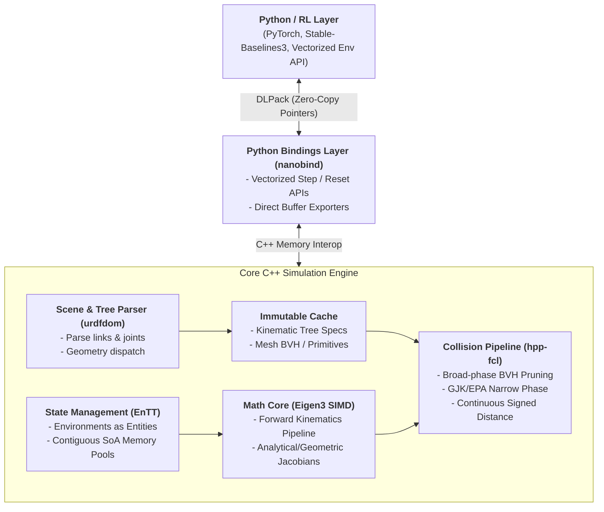

# Implementation

## 1. System Overview & Core Philosophy

This project implements a high-throughput, purely kinematic simulation engine designed specifically for vectorized Reinforcement Learning (RL) environments. The engine intentionally strips out contact dynamics, mass matrices, and force calculations, focusing entirely on:

* Fast, vectorized Forward Kinematics (FK) and numerical/analytical kinematic Jacobians.
* Exact continuous minimum-distance and collision queries.
* Strict state-structure separation to enable massively parallel execution across CPU threads and GPU streams without redundant allocations.
* Zero-copy shared-memory ingestion into PyTorch/JAX via `nanobind` and the `DLPack` tensor interface.



---

## 2. Subsystem Architecture

### 2.1 Scene Parsing & Geometry Extraction (`urdfdom`)

* **Role:** Parse Unified Robot Description Format (URDF) models into in-memory kinematic trees at startup.
* **Responsibilities:**
    * Ingest standard URDF kinematic descriptions into a Directed Acyclic Graph (DAG) representing links and joints.
    * Extract spatial transforms, joint constraints (revolute, prismatic, continuous, fixed), axis vectors, and hardware limits ($q_{\min}, q_{\max}, \dot{q}_{\max}$).
    * Separate visual geometry tags from collision geometry tags.
    * Construct a shared, read-only `KinematicModel` blueprint that all environment instances reference.


### 2.2 Mathematical Core & State Management (`Eigen3` + `EnTT`)

* **Role:** Manage thousands of concurrent environment states using an Entity Component System (ECS) architecture, executing vector math via SIMD-aligned linear algebra.
* **Component-Level Design (`EnTT`):**
    * Every simulation instance (RL environment) is instantiated as an `entt::entity`.
    * Components are stored as contiguous Struct-of-Arrays (SoA):
    * `JointStateComponent`: Dense arrays of generalized positions $q \in \mathbb{R}^N$ and velocities $\dot{q} \in \mathbb{R}^N$.
    * `TransformComponent`: Dense arrays of global link transformation matrices $T_i \in SE(3)$.
    * `JacobianComponent`: Link-to-base spatial and geometric Jacobians $J \in \mathbb{R}^{6 \times N}$.
    * `CollisionQueryComponent`: Distance margins, contact pair indices, and penetration vectors.
* **Algebraic Routines (`Eigen3`):**
    * **Forward Kinematics (FK):** Recursive propagation of coordinate frames down the kinematic tree:
    $$T_i(q) = T_{\text{parent}(i)} \cdot T_{\text{joint}(i)}(q_i)$$
    * **Kinematic Jacobian:** Closed-form computation mapping joint velocities $\dot{q}$ to end-effector spatial twists $V = [\omega^T, v^T]^T$:
    $$V = J(q)\dot{q}$$
    * All internal Eigen types use 16/32-byte memory alignment (`Eigen::aligned_allocator`) to maximize AVX-256/AVX-512 SIMD vectorization during vectorized stepping loops.

### 2.3 Geometry & Collision Pipeline (`hpp-fcl`)

* **Role:** High-speed distance checking, obstacle clearance estimation, and contact detection.
* **Responsibilities:**
    * Instantiate persistent `hpp::fcl::CollisionGeometry` representations for all immutable collision bodies (boxes, cylinders, spheres, convex mesh hulls).
    * Build and maintain dynamic Bounding Volume Hierarchies (BVH trees, such as AABB and OBB) to accelerate broad-phase pruning.
    * Execute narrow-phase checks via optimized GJK (Gilbert-Johnson-Keerthi) and EPA (Expanding Polytope Algorithm) solvers:
* **Boolean Collision:** Early-exit flags indicating self-collision or environment collision.
* **Continuous Minimum Distance:** Exact scalar Euclidean distance $d(A, B)$ and nearest-point pairs between robot links and environmental obstacles to provide dense RL reward signals.

### 2.4 RL Interop & Zero-Copy Tensor Protocol (`nanobind` + `DLPack`)

* **Role:** Expose high-speed C++ step and reset functions directly to Python while bypassing GIL and serialization overhead.
* **Responsibilities:**
    * **Memory Layout Parity:** Keep `EnTT` component arrays row-major contiguous or standard strided format matching standard PyTorch tensor descriptors.
    * **DLPack Protocol:** Wrap contiguous C++ memory buffers (e.g., $B \times N_{\text{joints}}$ positions, $B \times 6$ end-effector poses, $B \times 1$ collision flags) inside `DLManagedTensor` structures.
    * **Tensor Casting:** Expose functions in Python via `nanobind` such that calling `env.get_states()` yields native `torch.Tensor` instances on CPU or GPU without invoking `memcpy`.

---

## 3. Containerization Architecture

The system uses a decoupled dual-container configuration managed by Docker Compose:

```
.
├── docker/
│   ├── Dockerfile.cpu       # Optimized for multi-threaded x86 SIMD compilation
│   ├── Dockerfile.gpu       # CUDA-enabled toolkit for GPU-accelerated collision/FK
└── docker-compose.yml   # Multi-service coordinator with volume mounts

```

### 3.1 CPU Runtime (`Dockerfile.cpu`)

* **Base Image:** `ubuntu:22.04`
* **Toolchain:** `gcc-12`, `g++-12`, `cmake`, `ninja-build`
* **Dependencies:** Pre-compiled `libeigen3-dev`, `liburdfdom-dev`, `hpp-fcl`, Python 3.10+ development headers, and PyTorch (CPU variant).
* **Compiler Flags:** `-O3 -march=native -mavx2 -mfma -fopenmp -DNDEBUG`

### 3.2 GPU Runtime (`Dockerfile.gpu`)

* **Base Image:** `nvidia/cuda:12.4.1-devel-ubuntu22.04`
* **Toolchain:** CUDA Toolkit, `nvcc`, `gcc-12`, `g++-12`, `cmake`, `ninja-build`
* **Dependencies:** GPU-compatible runtime bindings, Unified Memory support flags, CUDA-enabled PyTorch, and identical C++ library interfaces.
* **Compiler Flags:** Host flags matching CPU build plus `nvcc` flags (`-O3 --use_fast_math -Xcompiler "-fPIC"`).

### 3.3 Orchestration (`docker-compose.yml`)

* Defines two services: `sim-cpu` and `sim-gpu`.
* Configures GPU passthrough via `deploy.resources.reservations.devices` with the `nvidia-container-toolkit`.
* Mounts local development directories into `/workspace` to facilitate dynamic iteration on Python RL algorithms, URDF files, and C++ source code without container rebuilds.

---

## 4. Proposed Repository Directory Structure

```
kinematic-sim/
├── .devcontainer/               # Optional VS Code container config
├── assets/                      # Shared robot URDFs and collision meshes
│   ├── robots/
│   │   └── manipulator.urdf
│   └── meshes/
├── cmake/                       # CMake helper modules
│   └── FindHPPFCL.cmake
├── docker/
│   ├── Dockerfile.cpu
│   └── Dockerfile.gpu
├── docs/                        # Architecture & API documentation
├── include/                     # Public C++ Header Files
│   └── kinsim/
│       ├── core/
│       │   ├── types.hpp        # Matrix aliases, typedefs, DLPack wrappers
│       │   ├── ecs.hpp          # EnTT components and registry wrapper
│       │   └── forward_kin.hpp  # FK and Jacobian algorithms
│       ├── parser/
│       │   └── urdf_loader.hpp  # urdfdom parsing utilities
│       ├── collision/
│       │   └── collision_engine.hpp # hpp-fcl context and queries
│       └── engine.hpp           # Main simulation batch coordinator
├── src/                         # C++ Implementation Files
│   ├── core/
│   │   ├── forward_kin.cpp
│   │   └── ecs.cpp
│   ├── parser/
│   │   └── urdf_loader.cpp
│   ├── collision/
│   │   └── collision_engine.cpp
│   └── engine.cpp
├── python/                      # Python bindings and RL wrapper
│   ├── bindings/
│   │   └── bindings.cpp         # nanobind entry points and DLPack converters
│   └── kinsim/
│       ├── __init__.py
│       └── env.py               # Gym / Gymnasium vectorized wrapper
├── tests/                       # C++ Catch2/GTest and Python pytest suites
│   ├── test_kinematics.cpp
│   ├── test_collision.cpp
│   └── test_bindings.py
├── CMakeLists.txt               # Top-level build definitions
├── docker-compose.yaml
└── pyproject.toml               # Python packaging build specs (scikit-build-core)

```

---

## 5. Execution Pipeline (Per-Step Sequence)

1. **Action Ingestion:** Python passes a 2D `torch.Tensor` ($B \times N_{\text{joints}}$) of target joint velocities $\dot{q}$ or position deltas $\Delta q$.
2. **DLPack Handshake:** `nanobind` extracts the raw pointer with zero copy.
3. **ECS State Integration:**
    * Joint limits are applied: $q_{t+1} = \text{clamp}(q_t + \dot{q} \cdot \Delta t, q_{\min}, q_{\max})$.
    * Contiguous arrays within `EnTT` update in place.
4. **Vectorized Forward Kinematics:** Recursive transformation updates compute link poses $T_i$ across all entities using SIMD vector pipelines.
5. **Collision & Distance Queries:**
    * Updated transformations populate `hpp::fcl::Transform3f` instances.
    * Broad-phase checks eliminate distant link-obstacle pairs.
    * Narrow-phase solvers compute exact clearances and collision booleans.
6. **Observation Tensor Return:** Memory pointers referencing the updated positions, end-effector poses, and obstacle clearances wrap into DLPack tensors and return directly to PyTorch without memory reallocation.